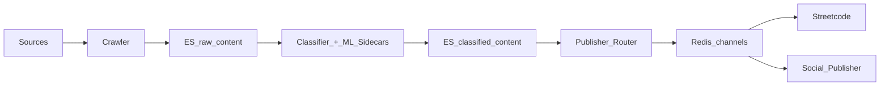

Ahnii!

> **Series context:** This is part 2 of a five-part series on [Codified Context]() — a three-tier architecture for reliable AI-assisted development in complex codebases. Read [part 1]() for the problem setup.

Most CLAUDE.md files are written like README files — a description of the project, some setup commands, maybe a style note or two. That's not a constitution. A constitution answers one question for every AI session that opens it: *where do I look?*

This post covers what belongs in a project constitution, what doesn't, and how to structure the orchestration trigger table that makes the whole system work.

## The Constitution's Job

Tier 1 in the three-tier [Codified Context](https://arxiv.org/abs/2602.20478) architecture is hot memory — loaded automatically at the start of every session, every time. Because it's always loaded, it has two constraints that shape everything about how you write it:

**It must stay small.** The target is under 200 lines. Over 300 lines and you're wasting context on content that doesn't belong in hot memory. If something is too detailed for the constitution, it belongs in a skill (Tier 2) or a spec (Tier 3).

**It must answer "where do I look?", not "how does it work?"** Implementation details belong in specs. Domain logic belongs in skills. The constitution's job is routing — getting any session to the right deeper knowledge fast.

## The Orchestration Trigger Table

The most important thing in a project constitution is the orchestration trigger table. This is a mapping from file patterns to the skills and specs that cover them.

Here's the table from north-cloud's `CLAUDE.md`:

| File pattern | Service context | Spec |
|---|---|---|
| `crawler/**` | `crawler/CLAUDE.md` | `docs/specs/content-acquisition.md` |
| `classifier/**`, `ml-sidecars/**` | `classifier/CLAUDE.md` | `docs/specs/classification.md` |
| `publisher/**` | `publisher/CLAUDE.md` | `docs/specs/content-routing.md` |
| `search/**`, `index-manager/**` | `search/CLAUDE.md`, `index-manager/CLAUDE.md` | `docs/specs/discovery-querying.md` |
| `infrastructure/**` | — | `docs/specs/shared-infrastructure.md` |
| `social-publisher/**` | `social-publisher/CLAUDE.md` | `docs/specs/social-publisher.md` |
| `rfp-ingestor/**` | `rfp-ingestor/CLAUDE.md` | `docs/specs/rfp-ingestor.md` |
| `docs/specs/**`, `.claude/**`, `**/CLAUDE.md` | updating-codified-context | — |

Any session working in the crawler reads this table, loads `crawler/CLAUDE.md`, and knows where to find the content acquisition spec. It doesn't need to explore the codebase to understand the service boundaries — the table tells it.

The table is cheap to maintain and enormously useful. A session working on the classifier doesn't need to know anything about the publisher. The table enforces that separation.

## The Architecture Summary

Below the trigger table, the constitution needs a brief system architecture. Not a full design doc — a few sentences and a diagram that captures the dependency structure.

North-cloud's content pipeline is described in nine lines:

Followed by the publisher routing layers (L1 through L11) and one critical dependency rule: services import only from `infrastructure/`. No cross-service imports.

That's all a session needs to understand the system at the macro level. If it needs more, the orchestration table points it to the right spec.

## Common Operations

The third section of a useful constitution is an operations list: the four or five tasks that happen repeatedly across sessions, each described in three to five steps.

North-cloud's common operations:

- **Add a new source:** Add via source-manager API → crawler picks up on next schedule → raw content indexed → classifier processes → publisher routes
- **Add a new ML sidecar:** Create `ml-sidecars/{name}-ml/` with Flask app → add `{name}mlclient` in classifier → add env flag → add routing layer in publisher → update docker-compose
- **Add a publisher channel:** Create channel via publisher API → content matching rules routes to Redis → consumers subscribe

These aren't implementation guides. They're maps. A session working on a new ML sidecar reads this and immediately understands the full change surface — four services, specific files in each. Without it, the session would explore the codebase to reconstruct this knowledge every time.

## Critical Gotchas: The Most Valuable Section

The section most developers underweight is the critical rules list — the non-obvious constraints that recur as mistakes across sessions.

North-cloud's critical rules are worth reading in full because they illustrate what belongs here:

- **Never use `interface{}`** — always use `any` (Go 1.18+). The linter flags violations as errors.
- **Never ignore JSON marshal/unmarshal errors** — always check them.
- **Never use magic numbers** — always define named constants.
- **All test helper functions must start with `t.Helper()`** — the linter enforces this.
- **Keep cognitive complexity ≤ 20** — `gocognit` flags violations immediately.
- **`content_type` must be `text`, not `keyword`** — the search service queries `content_type.keyword`, which only exists on `text` fields.
- **Never use `os.Getenv` directly** — use the `infrastructure/config` package instead. The `forbidigo` linter enforces this.

Every one of these was added because a session got it wrong. They're not style preferences — they're load-bearing rules that, if missed, produce broken CI or broken search. They live in the constitution because they apply everywhere.

## The 200-Line Discipline

North-cloud's full `CLAUDE.md` is 293 lines, which runs a little long. The target is under 200 lines, and the right way to stay under it is simple: if a section is growing detailed, it belongs in a specialist skill or a spec, not the constitution.

Some signals that content has outgrown the constitution:

- More than five steps in an "operations" recipe
- Documentation for a single service buried in the root CLAUDE.md
- Interface signatures or data structures that only matter for one subsystem
- Anything that reads like "how it works" rather than "where to look"

When you hit these, extract. Move service-specific content into `service/CLAUDE.md` files. Move architectural details into specs. Keep the root CLAUDE.md as a routing layer, not a knowledge dump.

## Waaseyaa: Scaling to 29 Packages

The waaseyaa PHP framework has 29 packages across seven architectural layers. Its root `CLAUDE.md` runs to roughly 17KB — significantly larger than the north-cloud example, but structured to handle the complexity.

The difference is that waaseyaa's constitution manages a monorepo where every package is part of the same layered system, with explicit dependency rules between layers. The layer architecture section alone needs to capture enough about those rules to prevent a session from importing a Layer 3 service into Layer 1 code.

What waaseyaa does right: its orchestration table maps eight package groups to `waaseyaa:*` entries, each backed by a subsystem spec retrieved via MCP tools. The constitution doesn't carry implementation details — it routes sessions to the right spec, and the MCP retrieval delivers the knowledge.

What stays in waaseyaa's constitution: the layer dependency rules, the package inventory, the common operations that span multiple layers, and the critical gotchas that apply framework-wide.

## What Doesn't Belong in the Constitution

A few things commonly end up in CLAUDE.md files that should live elsewhere:

**Full API documentation.** If you're documenting method signatures and parameter types, that belongs in a spec, not the constitution.

**Step-by-step tutorials.** Operations checklists are three to five steps. Anything longer is a specialist skill.

**Service-specific logic.** If a rule only applies to the crawler, it belongs in `crawler/CLAUDE.md`, not the root.

**Things that change frequently.** The constitution should contain stable architectural knowledge. If a section needs updating every week, it probably belongs in a spec with a clear ownership model.

The constitution is not where you put everything important about your codebase. It's where you put the minimum necessary to route any session to the right deeper knowledge — and make sure the most dangerous mistakes don't happen.

## What's Next

Next: [Part 3 — Specialist skills]() — the on-demand agents that carry the deep knowledge the constitution can't hold.

Baamaapii
