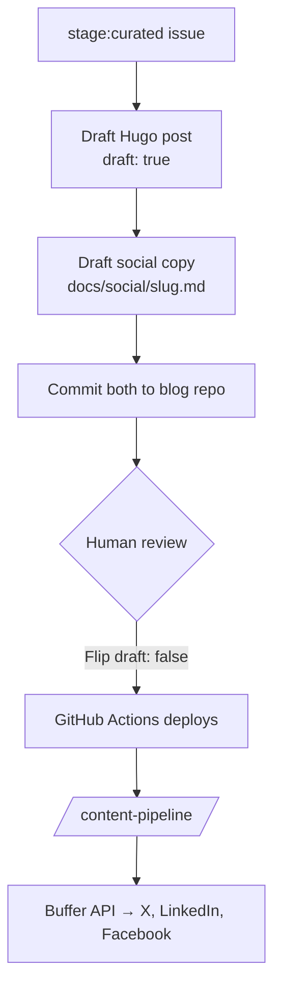

Ahnii!

Yesterday's post walked through [automating a content pipeline with GitHub Actions and Issues](). The idea: a daily scheduled job scans recent commits and closed issues across several repos, filters out the noise, and opens what's left as GitHub issues labeled `stage:mined`. One of those issues looks something like this:

```text
Title: [content] feat: add SovereigntyProfile to Layer 0
Body:
  ## Source
  Commit `abc1234` in `waaseyaa/framework`
  ## Content Seed
  feat: add SovereigntyProfile to Layer 0
  ## Suggested Type
  text-post
```

Those issues are raw material. You curate them into drafts, produce the copy, and publish. That surfacing step is what the rest of this post calls *mining*. This post is about what happened the first time I actually ran that pipeline. The short version: it works, but the first real run turned up three problems no amount of planning could have caught. Here are the three fixes and the meta-lesson underneath them.

## Day One Output: 20 Issues, Too Much Noise

The mining workflow fired on schedule and opened 20 `stage:mined` issues overnight, pulled from three repos. Good news: the pipeline saw everything it was supposed to see. Bad news: "everything" is not the same as "a usable drafting queue." The first run had more noise than I expected, and it had noise the filter couldn't see.

## Fix 1: Tighten the Mining Filter

Even with the v1 noise filter, too many low-signal commits made it through. Things like `fix: align FileRepositoryInterface usage with Waaseyaa\Media\File contract` matter for the codebase and are boring as standalone posts. The first fix was to extend the exclude regex in `content-mine.yml`:

```bash
COMMITS=$(gh api "repos/$REPO/commits?since=$SINCE&per_page=50" \
  --jq '.[] | select(.commit.message | test("^(Merge |chore|docs|fix typo|bump|update dep|Bump |fix:.*([Pp]hp[Ss]tan|namespace|alignment|placeholder|phpunit|mock|ignore|typo))"; "i") | not) | {sha: .sha[0:7], message: (.commit.message | split("\n") | .[0]), date: .commit.author.date}' \
  2>/dev/null || echo "")
```

The new patterns (`phpstan`, `namespace`, `alignment`, `placeholder`, `phpunit`, `mock`, `ignore`, `typo`) catch categories of real work nobody wants to read about. A minimum message length of 25 characters cuts drive-by fixes. Fewer mined issues per run, and the ones that survive sit closer to "actually postable." That handled the mechanical noise. The next problem was harder because no regex could see it.

## Fix 2: Merge-in-Curation

Filters are a blunt instrument. They cannot tell that eight separate commits all belong to the same post. On day one, the [Giiken](https://github.com/waaseyaa/giiken) project alone produced eight mined issues: scaffold, entity types, RBAC, ingestion, wiki schema, query layer, plus two support commits. Every one of them was a valid feature commit. Together they were one post. No filter was going to catch that. Only a human reading them side by side could say "these are a story."

So curation got a new action: **merge into target**. Instead of picking one winner and closing the rest, you pick a canonical issue, roll the seeds from the others into its body, and close the sources. The target ends up carrying a combined seed (the whole story), and the sub-issues get a `skipped` label and a closed state.

The curation skill now runs like this:

```text
→ Approve (move to stage:curated)
→ Skip   (close with skipped label)
→ Merge  (pick target, combine seeds, close sources)
→ Edit   (adjust seed, type, or channels before approving)
```

Running that over the 20 mined issues collapsed them to 4 curated posts: one about the pipeline itself, one about the Giiken project, one about a governance protocol suite in the framework, and one about a specific Symfony refactor. Signal up, count down. Two fixes done. The third was the embarrassing one.

## Fix 3: Put the Blog First

The v1 production step went straight from a curated issue to Facebook, X, and LinkedIn copy. That read fine in the design doc. It fell apart the first time I tried to run it, because every one of those social posts had a placeholder where the URL should go. The URL had to point at a blog post. The blog post did not exist yet.

So I rewrote the `/content-produce` skill — a [Claude Code](https://claude.com/claude-code) workflow that turns queue issues into drafts. The new flow:



The human controls publication. The skill commits drafts only and never flips `draft: false`. Once I flip the flag and push, [GitHub Actions](https://docs.github.com/en/actions) deploys the post, and a separate `/content-pipeline` skill handles the Buffer API for social distribution. Each step has one job. This post you're reading is the first one produced by the new flow.

## Why Content Pipelines Need Continuous Refinement

You cannot design a content pipeline in the abstract. You ship v1, run it against one day of real input, and watch it lie to you. Then you fix the specific lies. That loop is the work.

Three days ago this pipeline did not exist. Two days ago it was a spec. Yesterday it shipped. Today it is already different. None of the three fixes in this post were things I could have known up front. They came from running the thing, staring at the output, and asking "what is this queue actually trying to tell me?"

If you are building your own version of this, expect the same arc. Your v1 will have noise you cannot see yet. Your first curation session will reveal merges a filter could not find. And your production step will probably be backwards, because writing the fun part first (the tweets) is more tempting than writing the part that does the work (the blog post). The refinement is not a sign something went wrong. It is the point.

Baamaapii
