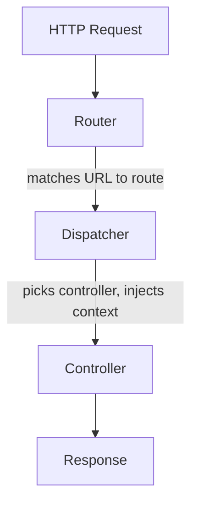

Ahnii!

[Waaseyaa](https://github.com/waaseyaa/framework) had a controller dispatcher that grew past 1,000 lines. Every new feature meant more conditionals in the same file. This post covers how that dispatcher was replaced with domain-specific routers, each implementing a two-method interface that keeps routing logic scoped and testable.

## What a Dispatcher Does



The router matches a URL to a route definition. The dispatcher takes that match and figures out which controller to instantiate, which method to call, and how to pass in the request context. In most frameworks, you never think about it because the framework handles it for you.

The problem starts when the dispatcher becomes the place where "which code to run" turns into a long chain of conditionals.

## Why a Monolithic Dispatcher Breaks Down

A single dispatcher that handles every request type accumulates conditionals fast. You end up with something like this:

```php
public function dispatch(Request $request): Response
{
    $controller = $request->attributes->get('_controller');

    if ($controller === 'entity_types') {
        // 40 lines of entity type listing logic
    } elseif (str_starts_with($controller, 'entity_type.')) {
        // 60 lines of lifecycle management
    } elseif ($controller === 'openapi') {
        // 80 lines of OpenAPI spec generation
    } elseif (str_contains($controller, 'SchemaController')) {
        // 50 lines of schema handling
    }
    // ... and so on for every domain
}
```

Entity CRUD, schema generation, lifecycle management, OpenAPI docs: all funneling through one class. Each new feature adds another branch, and testing any one path means loading the context for all of them.

The fix isn't a better dispatcher. It's smaller, focused routers that each own one domain.

## The DomainRouterInterface Contract

A domain router is a small class that owns one slice of your application's request handling. Instead of one dispatcher knowing about every domain, each router answers two questions: "Is this request mine?" and "How do I handle it?" The interface makes this explicit:

```php
interface DomainRouterInterface
{
    // "Is this request mine?" — inspects the request, returns a boolean.
    public function supports(Request $request): bool;

    // "Yes, handle it." — does the work, returns a response.
    public function handle(Request $request): Response;
}

// The dispatcher iterates registered routers in order.
// First one to return true from supports() wins.
```

This is the Chain of Responsibility pattern with an explicit contract.

## EntityTypeLifecycleRouter: A Complete Example

Waaseyaa lets you define entity types (think "Article", "User", "Comment"). Sometimes you need to disable one, maybe you're deprecating a content type, or re-enable one that was turned off. That's what this router handles. Here's the full class:

```php
final class EntityTypeLifecycleRouter implements DomainRouterInterface
{
    use JsonApiResponseTrait; // consistent JSON:API response formatting

    public function __construct(
        // Registry: knows which entity types exist and their capabilities
        private readonly EntityTypeManager $entityTypeManager,
        // Handles disable/enable state changes
        private readonly EntityTypeLifecycleManager $lifecycleManager,
    ) {}

    public function supports(Request $request): bool
    {
        // Prefix match: anything starting with "entity_type." belongs here.
        // Adding entity_type.archive later requires zero changes to this method.
        $controller = $request->attributes->get('_controller', '');

        return $controller === 'entity_types'
            || str_starts_with($controller, 'entity_type.');
    }

    public function handle(Request $request): Response
    {
        $controller = $request->attributes->get('_controller', '');

        return match ($controller) {
            'entity_types'        => $this->listTypes($request),
            'entity_type.disable' => $this->disableType($request),
            'entity_type.enable'  => $this->enableType($request),
            default               => $this->jsonApiResponse(404, []),
        };
    }
}
```

One class, one domain, fully testable in isolation.

## SchemaRouter: Same Pattern, Different Domain

Your API also needs to serve OpenAPI specs and schema definitions for each entity type. That's a different domain from lifecycle management, so it gets its own router:

```php
final class SchemaRouter implements DomainRouterInterface
{
    use JsonApiResponseTrait;

    public function __construct(
        private readonly EntityTypeManager $entityTypeManager,
        // Schema endpoints enforce the same access rules as the entities themselves.
        // Can't access an entity type? Can't read its schema either.
        private readonly EntityAccessHandler $accessHandler,
    ) {}

    public function supports(Request $request): bool
    {
        $controller = $request->attributes->get('_controller', '');

        return $controller === 'openapi'
            || str_contains($controller, 'SchemaController');
    }

    public function handle(Request $request): Response
    {
        $controller = $request->attributes->get('_controller', '');

        if ($controller === 'openapi') {
            return $this->generateOpenApiSpec($request);
        }

        // SchemaController routes carry the entity type as a route parameter
        $entityType = $request->attributes->get('entity_type_id', '');
        return $this->showSchema($entityType, $request);
    }
}
```

Both routers pull typed context from the request without doing any parsing themselves. Where does that context come from?

## Routers Get a Fully Loaded Request

Middleware upstream handles authentication, body parsing, and context assembly before any router sees the request:

```php
// By the time handle() runs, the request carries everything the router needs.
// No token parsing, no JSON decoding, no service lookups.
$account = $request->attributes->get('_account');           // authenticated user
$storage = $request->attributes->get('_broadcast_storage'); // storage backend
$body    = $request->attributes->get('_parsed_body');       // deserialized JSON
$context = $request->attributes->get('_waaseyaa_context');  // framework context
```

The infrastructure work happens once, upstream. Routers stay focused on domain logic.

## Adding a New Router

Here's a skeleton for a new domain. Say you want to handle bulk import operations:

```php
final class BulkImportRouter implements DomainRouterInterface
{
    use JsonApiResponseTrait;

    public function supports(Request $request): bool
    {
        return str_starts_with(
            $request->attributes->get('_controller', ''),
            'bulk_import.',
        );
    }

    public function handle(Request $request): Response
    {
        $controller = $request->attributes->get('_controller', '');

        return match ($controller) {
            'bulk_import.csv'  => $this->importCsv($request),
            'bulk_import.json' => $this->importJson($request),
            default            => $this->jsonApiResponse(404, []),
        };
    }
}
```

No existing router changes. No dispatcher modifications. Register it in the router collection and the dispatcher picks it up. The interface guarantees new domains are additive.

## What This Gets You

The 1,000-line dispatcher is gone. In its place: small classes with clear boundaries, each testable in isolation:

```php
$router = new EntityTypeLifecycleRouter($entityTypeManager, $lifecycleManager);
$request = new Request();
$request->attributes->set('_controller', 'entity_type.disable');
$request->attributes->set('_parsed_body', ['entity_type_id' => 'article']);

$response = $router->handle($request);
// No framework boot, no database, no middleware chain
```

When you see a request to `entity_type.disable`, you know exactly which file handles it. No tracing through a switch statement in a god class.

Baamaapii
